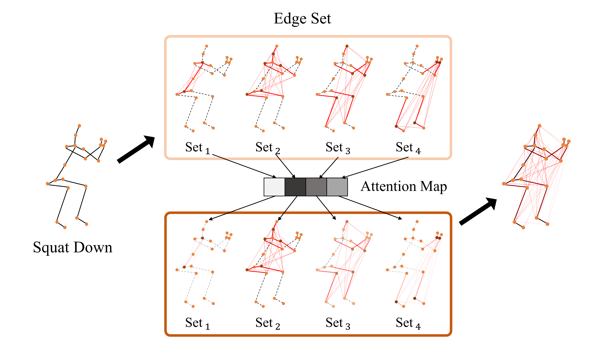

# HD-GCN

Official Implementation of [Hierarchically Decomposed Graph Convolutional Networks for Skeleton-Based Action Recognition](https://arxiv.org/abs/2208.10741).

[](https://paperswithcode.com/sota/skeleton-based-action-recognition-on-ntu-rgbd?p=hierarchically-decomposed-graph-convolutional)
[](https://paperswithcode.com/sota/skeleton-based-action-recognition-on-ntu-rgbd-1?p=hierarchically-decomposed-graph-convolutional)
[](https://paperswithcode.com/sota/skeleton-based-action-recognition-on-n-ucla?p=hierarchically-decomposed-graph-convolutional)



# Abstract

Graph convolutional networks (GCNs) are the most commonly used methods for skeleton-based action recognition and have achieved remarkable performance. Generating adjacency matrices with semantically meaningful edges is particularly important for this task, but extracting such edges is challenging problem. To solve this, we propose a hierarchically decomposed graph convolutional network (HD-GCN) architecture with a novel hierarchically decomposed graph (HD-Graph). The proposed HD-GCN effectively decomposes every joint node into several sets to extract major structurally adjacent and distant edges, and uses them to construct an HD-Graph containing those edges in the same semantic spaces of a human skeleton. In addition, we introduce an attention-guided hierarchy aggregation (A-HA) module to highlight the dominant hierarchical edge sets of the HD-Graph. Furthermore, we apply a new six-way ensemble method, which uses only joint and bone stream without any motion stream. The proposed model is evaluated and achieves state-of-the-art performance on three large, popular datasets: NTU-RGB+D 60, NTU-RGB+D 120, and Northwestern-UCLA. Finally, we demonstrate the effectiveness of our model with various comparative experiments.

# Dependencies

- Python >= 3.6
- PyTorch >= 1.10.0
- PyYAML == 5.4.1
- torchpack == 0.2.2
- matplotlib, einops, sklearn, tqdm, tensorboardX, h5py
- Run `pip install -e torchlight` 

# Data Preparation

### Download datasets.

#### There are 3 datasets to download:

- NTU RGB+D 60 Skeleton
- NTU RGB+D 120 Skeleton
- NW-UCLA

#### NTU RGB+D 60 and 120

1. Request dataset here: https://rose1.ntu.edu.sg/dataset/actionRecognition
2. Download the skeleton-only datasets:
   1. `nturgbd_skeletons_s001_to_s017.zip` (NTU RGB+D 60)
   2. `nturgbd_skeletons_s018_to_s032.zip` (NTU RGB+D 120)
   3. Extract above files to `./data/nturgbd_raw`

#### NW-UCLA

1. Download dataset from here: https://www.dropbox.com/s/10pcm4pksjy6mkq/all_sqe.zip?dl=0
2. Move `all_sqe` to `./data/NW-UCLA`

### Data Processing

#### Directory Structure

Put downloaded data into the following directory structure:

```
- data/
  - NW-UCLA/
    - all_sqe
      ... # raw data of NW-UCLA
  - ntu/
  - ntu120/
  - nturgbd_raw/
    - nturgb+d_skeletons/     # from `nturgbd_skeletons_s001_to_s017.zip`
      ...
    - nturgb+d_skeletons120/  # from `nturgbd_skeletons_s018_to_s032.zip`
      ...
```

#### Generating Data

- Generate NTU RGB+D 60 or NTU RGB+D 120 dataset:

```
 cd ./data/ntu # or cd ./data/ntu120
 # Get skeleton of each performer
 python get_raw_skes_data.py
 # Remove the bad skeleton 
 python get_raw_denoised_data.py
 # Transform the skeleton to the center of the first frame
 python seq_transformation.py
```

# Training & Testing

### Training

- NTU-RGB+D 60 & 120
```
# Example: training HD-GCN (joint CoM 1) on NTU RGB+D 60 cross subject with GPU 0
python main.py --config ./config/nturgbd60-cross-subject/joint_com_1.yaml --device 0

# Example: training HD-GCN (bone CoM 1) on NTU RGB+D 60 cross subject with GPU 0
python main.py --config ./config/nturgbd60-cross-subject/bone_com_1.yaml --device 0

# Example: training HD-GCN (joint CoM 1) on NTU RGB+D 120 cross subject with GPU 0
python main.py --config ./config/nturgbd120-cross-subject/joint_com_1.yaml --device 0

# Example: training HD-GCN (bone CoM 1) on NTU RGB+D 120 cross subject with GPU 0
python main.py --config ./config/nturgbd120-cross-subject/bone_com_1.yaml --device 0
```

- To train your own model, put model file `your_model.py` under `./model` and run:

```
# Example: training your own model on NTU RGB+D 120 cross subject
python main.py --config ./config/nturgbd120-cross-subject/your_config.yaml --model model.your_model.Model --work-dir ./work_dir/your_work_dir/ --device 0
```

### Testing

- To test the trained models saved in <work_dir>, run the following command:

```
python main.py --config <work_dir>/config.yaml --work-dir <work_dir> --phase test --save-score True --weights <work_dir>/xxx.pt --device 0
```

- To ensemble the results of different modalities, run 
```
# Example: six-way ensemble for NTU-RGB+D 120 cross-subject
python ensemble.py --datasets ntu120/xsub --main-dir ./work_dir/ntu120/cross-subject/
```

### Pretrained Weights

- Pretrained weights for NTU RGB+D 60 and 120 can be downloaded from the following link [[Google Drive]](https://drive.google.com/drive/folders/1FB_IQdTMWE8cRvwE2KiyxC0P6LyqZku4?usp=sharing).

## Acknowledgements
This repo is based on [2s-AGCN](https://github.com/lshiwjx/2s-AGCN) and [CTR-GCN](https://github.com/Uason-Chen/CTR-GCN). The data processing is borrowed from [SGN](https://github.com/microsoft/SGN) and [HCN](https://github.com/huguyuehuhu/HCN-pytorch).

Thanks to the original authors for their awesome works!

# Citation

Please cite this work if you find it useful:
```BibTex
@article{lee2022hierarchically,
  title={Hierarchically Decomposed Graph Convolutional Networks for Skeleton-Based Action Recognition},
  author={Lee, Jungho and Lee, Minhyeok and Lee, Dogyoon and Lee, Sangyoon},
  journal={arXiv preprint arXiv:2208.10741},
  year={2022}
}
```

# Contact
If you have any questions, feel free to contact: 2015142131@yonsei.ac.kr
